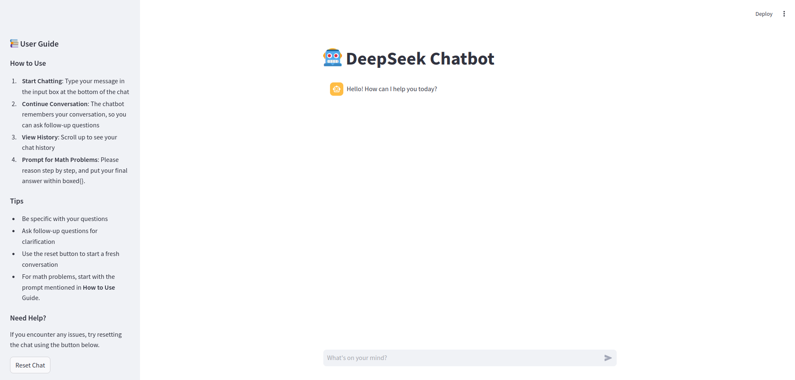

# Deepseek POC

Running Deepseek model offline using OLLAMA

## Get Started

Start the app using `start.sh` or simply run `streamlit run main.py`

1. Checkout `scripts` directory for pulling ollama deepseek model offline.

## Screenshots

